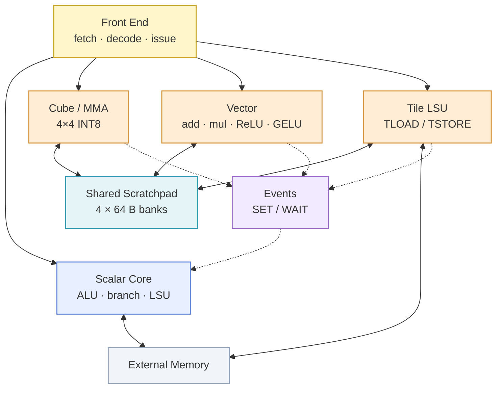

# tile-ooo

`tile-ooo` is a tile-oriented tensor processor implemented in Verilog/SystemVerilog and simulated with Verilator. It combines an out-of-order scalar control path with dedicated Cube, Vector, and Tile LSU units. A shared scratchpad, explicit events, and tile dependencies coordinate computation and data movement.

[简体中文](README.zh.md)

## Target Architecture

The processor has one hardware context and a shared fetch, decode, and instruction-classification front end. It supports asymmetric dual issue: at most one scalar instruction and one Cube, Vector, or Tile LSU command may issue per cycle. Dependencies and resource conflicts can reduce issue width.

| Path | Structure and responsibility |
| --- | --- |
| Scalar OoO path | Rename and allocation assign physical registers and ROB entries. The scalar issue queue holds instructions until their operands are ready. The scalar pipeline executes ALU, branch, and scalar LSU operations; results write back to the PRF and retire in program order through the ROB. |
| Tensor command path | Command queues and a scoreboard track Cube, Vector, and Tile LSU resources and tile dependencies. Commands issue when operands and execution resources are ready. |
| Cube | Executes 4 × 4 INT8 matrix multiply-accumulate operations with an INT32 accumulator. |
| Vector | Executes tile-wise add, multiply, ReLU, and fixed-point GELU operations. |
| Tile LSU | Transfers tiles asynchronously between external memory and the scratchpad using shape and stride information. |

## Storage, Dependencies, and Synchronization

Cube and Vector share a banked scratchpad. The baseline has four 64 B banks, each accepting at most one access per cycle. Capacity and bank count are configurable. Arbitration, queue stalls, and bank conflicts are recorded as performance counters.

Tile instructions explicitly specify scratchpad slots, such as `TLOAD t0` and `MMAC t2, t0, t1`. Tile renaming maps logical tiles to physical slots and tracks slot allocation and lifetime through a tile RAT and free list.

The scalar LSU and Tile LSU access external memory through a shared interface and arbiter. Cube and Vector exchange tile data through the scratchpad.

`WAIT e` blocks dependent work until event `e` is complete. `SET e` publishes the event after the associated command has completed and its scratchpad writes are visible. Event state tracks event scope, generation, and completion; the scoreboard independently tracks tile RAW dependencies.

## Instruction Model

The ISA is based on fixed 32-bit instructions. Tile shape and stride are represented with constrained encodings, registers, or descriptors.

| Category | Instructions |
| --- | --- |
| Scalar and control | `ADDI`, `ADD`, `SUB`, `LD`, `ST`, `BEQ`, `BLT`, `JMP`, `HALT` |
| Tile movement | `TLOAD`, `TSTORE` |
| Matrix compute | `MMAC` |
| Vector compute | `VADD`, `VMUL`, `VRELU`, `VGELU` |
| Synchronization and ordering | `SET`, `WAIT`, `FENCE` |

The ISA specification defines instruction encodings, illegal-instruction behavior, fixed-point arithmetic, overflow rules, reset semantics, and stall conventions.

## Verification and Observability

Verification covers scalar control, randomized 4 × 4 INT8 GEMM, overlapped tile movement and MMAC, vector post-processing, and small attention kernels. A Python/NumPy reference model uses fixed random seeds and explicit fixed-point, rounding, and overflow rules.

The simulator exports cycle traces and records ROB and queue occupancy, Cube and Vector busy cycles, Tile LSU utilization, scratchpad bank stalls, event stalls, command latency, and total cycles. FST waveforms are generated by default for inspection with GTKWave.

## Toolchain

- Verilog/SystemVerilog
- Verilator
- CMake, Ninja, Clang or GCC
- Python 3, pytest, NumPy
- GTKWave
- Git
