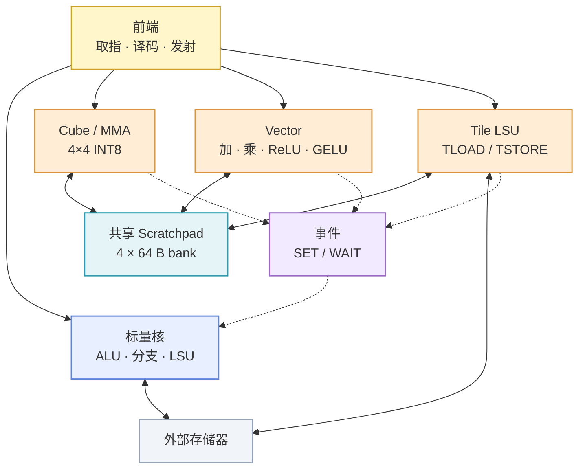

# tile-ooo

`tile-ooo` 是一个面向 tile 张量计算的处理器，使用 Verilog/SystemVerilog 实现 RTL，并由 Verilator 进行周期级仿真。处理器将标量乱序控制路径与 Cube、Vector、Tile LSU 专用单元结合，通过共享 scratchpad、显式事件和 tile 依赖组织计算与数据搬运。

[English](README.md)

## 目标架构

处理器包含一个硬件上下文，以及共享的取指、译码和指令分类前端。采用非对称双发射：每周期最多发射一条标量指令和一条 Cube、Vector 或 Tile LSU 命令。数据依赖或资源冲突会降低发射宽度。

| 路径 | 结构与职责 |
| --- | --- |
| 标量乱序路径 | Rename / Allocate 分配物理寄存器和 ROB 项；标量 issue queue 保存尚未就绪的指令；标量流水线执行 ALU、分支和 scalar LSU 操作；结果写回 PRF，并由 ROB 按程序顺序提交。 |
| Tensor command 路径 | 命令队列和 scoreboard 跟踪 Cube、Vector、Tile LSU 的资源及 tile 依赖；操作数和执行资源就绪后发射命令。 |
| Cube | 执行 4 × 4 INT8 矩阵乘累加，使用 INT32 累加器。 |
| Vector | 执行 tile 级加法、乘法、ReLU 和定点 GELU。 |
| Tile LSU | 根据 shape 和 stride，在外部存储器与 scratchpad 之间异步搬运 tile。 |

## 存储、依赖与同步

Cube 和 Vector 共享 banked scratchpad。基线包含 4 个 64 B bank，每个 bank 每周期最多接受一次访问。容量和 bank 数可配置。仲裁、队列阻塞和 bank conflict 会记录为性能计数器。

Tile 指令显式指定 scratchpad 槽位，例如 `TLOAD t0` 和 `MMAC t2, t0, t1`。Tile renaming 通过 tile RAT、free list 和生命周期追踪，将逻辑 tile 映射到物理槽位并管理复用。

Scalar LSU 和 Tile LSU 通过共享接口及仲裁器访问外部存储器。Cube 与 Vector 通过 scratchpad 交换 tile 数据。

`WAIT e` 等待事件 `e` 完成后再继续相关工作。关联命令完成且 scratchpad 写入可见后，`SET e` 发布该事件。Event state 跟踪事件作用域、代际和完成状态；scoreboard 独立跟踪 tile 的 RAW 依赖。

## 指令模型

ISA 采用固定 32-bit 指令。Tile shape 和 stride 通过受限编码、寄存器或描述符表示。

| 类别 | 指令 |
| --- | --- |
| 标量与控制 | `ADDI`、`ADD`、`SUB`、`LD`、`ST`、`BEQ`、`BLT`、`JMP`、`HALT` |
| Tile 搬运 | `TLOAD`、`TSTORE` |
| 矩阵计算 | `MMAC` |
| 向量计算 | `VADD`、`VMUL`、`VRELU`、`VGELU` |
| 同步与排序 | `SET`、`WAIT`、`FENCE` |

ISA 规格定义指令编码、非法指令行为、定点算术、溢出规则、reset 语义和 stall 约定。

## 验证与可观测性

验证覆盖标量控制、随机 4 × 4 INT8 GEMM、tile 搬运与 MMAC 重叠、向量后处理和小型 attention 内核。Python/NumPy 参考模型使用固定随机种子，并按明确的定点、舍入和溢出规则比对结果。

仿真器导出逐周期 trace，并记录 ROB 和队列占用、Cube/Vector 忙碌周期、Tile LSU 利用率、scratchpad bank stall、event stall、命令延迟和总周期数。默认生成 FST 波形，可使用 GTKWave 查看。

## 工具链

- Verilog/SystemVerilog
- Verilator
- CMake、Ninja、Clang 或 GCC
- Python 3、pytest、NumPy
- GTKWave
- Git

